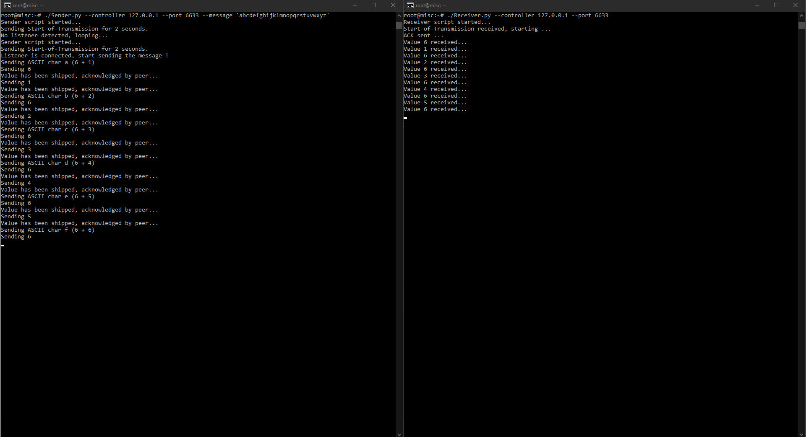
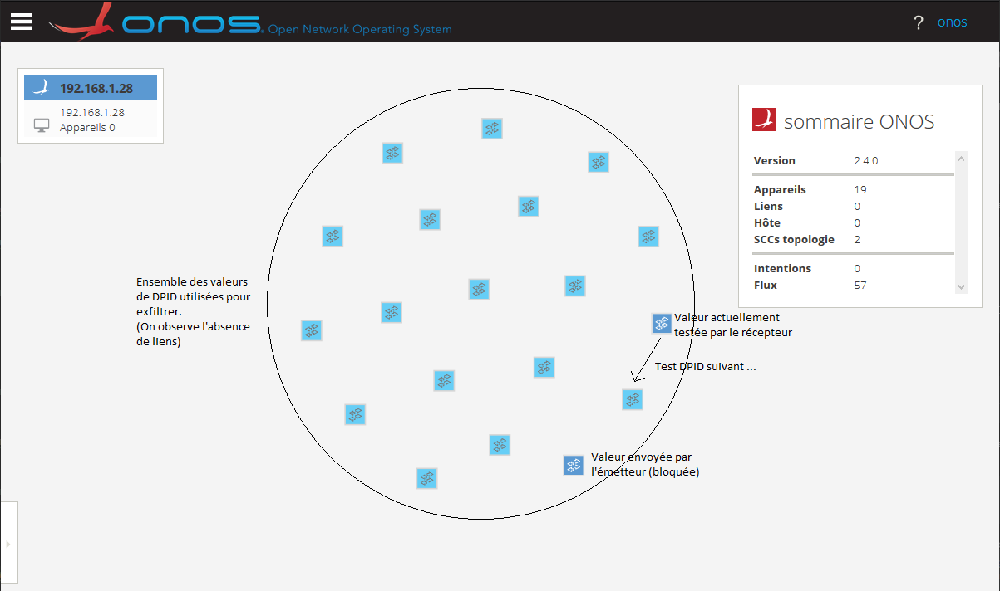

# Reproduction d'une attaque par téléportation sur un controleur ONOS

_Article MISC n° 1XX_

_Flavien Joly-Pottuz / Stefano Secci_ | _**CNAM PARIS**_

## Reproduction sur ONOS

Pour les besoins de la reproduction, il est nécéssaire d'ouvrir deux terminaux SSH:
+ Terminal émetteur
+ Terminal récepteur

### Lancement de l'attaque

Sur le terminal émetteur, invoquer le script émetteur :

```
python3 Sender.py --controller 127.0.0.1 --port 6633 --message ‘Mon Message’
```

Le script est désormais en attente d'un récepteur et boucle jusqu'a détecter la présence de celui-ci.

Sur le terminal récepteur, invoquer le script récepteur :

```
python Receiver.py --controller 127.0.0.1 --port 6633
```

L'émetteur et le recepteur vont alors commencer a échanger :





Un rapide coup d'oeil sur le dashboard permet de constater les différents DPID utilisés pour transférer les données :



